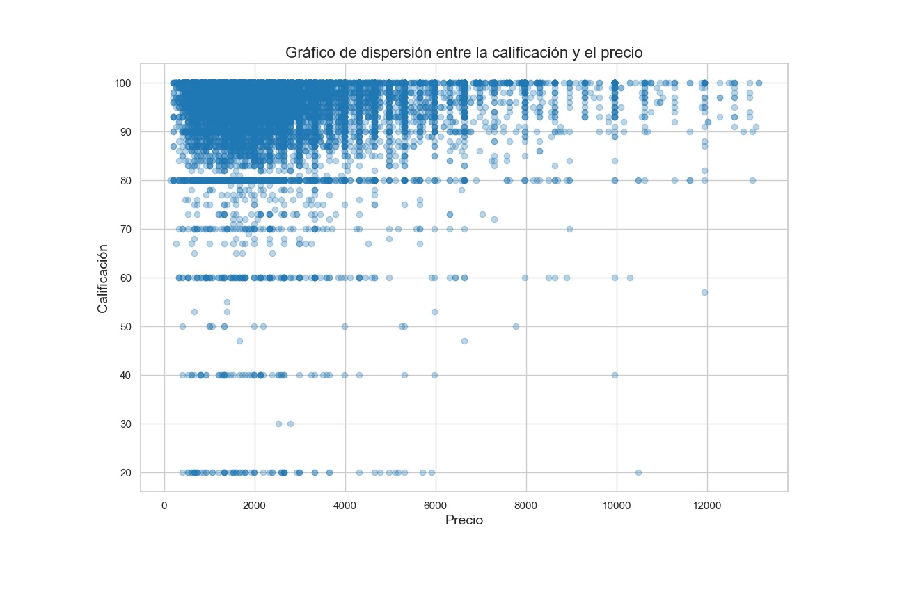
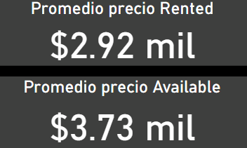

# Proyecto Integrador - Airbnb

 
**El objetivo de este trabajo práctico es aplicar los conceptos y técnicas aprendidos en el modulo para realizar un análisis exploratorio y descriptivo de un conjunto de datos reales.**

Para realizar el trabajo práctico se deberá seguir los siguientes pasos:

1. Descargar [archivos](https://drive.google.com/drive/folders/13gB8ZVUR66NQLA6G1aN4DpAG0ekeVwB5?usp=drive_link) con los datos.

2. Importar los datos en un la herramienta que deseen utilizar (Power Bi, Python).

3. Realizar una limpieza y validación preliminar de los datos, identificando y tratando posibles valores faltantes, erróneos o atípicos.[Carga de datos a power Bi](Carga%20de%20datos.md)

4. Realizar un análisis exploratorio de los datos, utilizando los conceptos aprendidos sobe dataviz y estadística para describir las variables y sus relaciones.[Análisis exploratorio](AnalisisExploratorio.ipynb)

5. Responder a las preguntas que plantea el negocio sobre el dataset elegido.

6. Elaborar un texto con las conclusiones de los resultados del análisis, incluyendo una introducción, una descripción de los datos, algunas respuestas a las preguntas planteadas, y unas conclusiones finales.

#### Preguntas 

* ¿Qué podemos describir con los datasets acerca del negocio de airbnb?
* ¿Cuál es la mejor forma de invertir en AirBnb?
* ¿Cómo se compara con otras alternativas de inversión?
* Si presentamos nuestras conclusiones a un grupo inversor: ¿Qué propuestas le haríamos?
* ¿En donde sugerimos invertir?
* ¿En qué tipo de propiedad?

#### Conjuntos de datos
| Archivo | Descripción |
| ------ | ----------- |
| [calendar.csv](https://drive.google.com/file/d/18snrMmPhM318uYQQKbb18zSxFjMF_zP7/view?usp=drive_link) | Contiene información sobre las fechas de ocupación del alojamiento y los precios asociados. |
| [listings.csv](https://drive.google.com/file/d/17TQknGYXe_rgYx0MGiFano_rSVF32Cnd/view?usp=drive_link) | Detalla las características del alojamiento, como su ubicación, el anfitrión, el número de habitaciones, baños, y más. |
| [reviews.csv](https://drive.google.com/file/d/1FjCzTPwcvcn3gYZwv2ak8aeAXMB2EdJa/view?usp=drive_link)| Contiene las calificaciones que los usuarios han dado a los alojamientos. |

## Introducción

En este proyecto, hemos empleado un conjunto de datos proporcionado para llevar a cabo un análisis del negocio de Airbnb. Airbnb es una empresa que actúa como intermediaria entre los propietarios de alojamientos y las personas en busca de un lugar donde hospedarse. Para llevar a cabo este análisis, utilizamos herramientas como Python para la exploración de datos y Power BI para crear un panel interactivo y amigable que permita a los usuarios observar y interactuar con los datos de manera efectiva.

## Limpieza de los datos

Durante el proceso de limpieza de datos, se realiza una revisión  de los conjuntos de datos. En el caso de las columnas que contienen un 100% de valores nulos, se optó por eliminarlas. Del mismo modo, los valores en blanco en el dataset se han reemplazado por la etiqueta **'No Data'**.

Se eliminaron aquellas columnas que no resultaban relevantes para los objetivos de este proyecto. Inicialmente, la tabla de listings contenía 106 columnas, pero después de la eliminación, se redujo a 49 columnas.

También se identificaron valores atípicos en la columna de precio de la tabla listings. En este caso, los valores atípicos se eliminaron del conjunto de datos. Inicialmente, la tabla de listados constaba de 23,729 filas, pero después de la eliminación de los valores atípicos, se redujo a 23,134 filas, lo que representó la eliminación del 2.5% de los datos.

Para determinar los valores atípicos, se calculó el promedio y la desviación estándar. Los valores que se encontraban a una distancia mayor a tres desviaciones estándar del promedio fueron considerados atípicos.

Se llevó a cabo la normalización de los títulos de las columnas, donde la primera letra de cada palabra se convirtió en mayúscula y se utilizó el guion bajo (_) en lugar de espacios. Además, se realizó la modificación de los tipos de datos según las necesidades de cada columna.

El detalle del procedimiento se muestra en el siguiente [enlace](Carga%20de%20datos.md) así como la carga de los archivos CSV en Power BI.

## Análisis Exploratorio de Datos

En esta sección, exploraremos el conjunto de datos para comprender las características del negocio a partir de los archivos CSV. Llevaremos a cabo el análisis de estadísticas descriptivas y la generación de visualizaciones de datos utilizando Python.

calendar

| Listing_id | Date       | Available  | Price  | Adjusted_price | Minimum_nights | Maximum_nights |
|------------|------------|------------|--------|----------------|-----------------|-----------------|
| 50778      | 2020-04-26 | Rented     | 2655.0 | $2,655.00      | 5.0             | 1125.0          |
| 133654     | 2020-04-27 | Available  | 1150.0 | $1,150.00      | 4.0             | 1125.0          |
| 133654     | 2020-04-28 | Available  | 1150.0 | $1,150.00      | 4.0             | 1125.0          |
| 133654     | 2020-04-29 | Available  | 1150.0 | $1,150.00      | 4.0             | 1125.0          |
| 133654     | 2020-04-30 | Available  | 1150.0 | $1,150.00      | 4.0             | 1125.0          |

listings

| Id_Listings     | Name                                      | Description                                   | Host_id | Host_name | Host_since | Host_response_time    | Host_response_rate | Host_acceptance_rate | Host_is_superhost | ... | Review_scores_cleanliness | Review_scores_checkin | Review_scores_communication | Review_scores_location | Review_scores_value | Instant_bookable    | Cancellation_policy          | Require_guest_profile_picture | Require_guest_phone_verification | Reviews_per_month |
|--------|-------------------------------------------|-----------------------------------------------|---------|-----------|------------|-----------------------|-------------------|----------------------|-------------------|-----|--------------------------|----------------------|--------------------------|----------------------|--------------------|--------------------|--------------------------|------------------------------|--------------------------------|-------------------|
| 11508  | Amazing Luxurious Apt-Palermo Soho       | LUXURIOUS NEW APT: 1 BDRM- POOL/ GYM/ SPA/ 24-... | 42762   | Candela   | 2009-10-01 | within a few hours   | 100%              | 100%                 | Superhost         | ... | 10.0                     | 10.0                 | 10.0                     | 10.0                 | 10.0               | NotInstantBookable | strict_14_with_grace_period | f                            | f                              | 0.27              |
| 12463  | Room in Recoleta - awesome location       | My apartment is centrally located in Recoleta ... | 48799   | Matt      | 2009-10-28 | within a few hours   | 100%              | No Data                  | Host              | ... | 10.0                     | 10.0                 | 10.0                     | 10.0                 | 10.0               | NotInstantBookable | moderate                    | f                            | f                              | 0.16              |
| 13095  | Standard Room at Palermo Viejo B&B        | Palermo Viejo B&B is a typical home in one of ... | 50994   | Ariel    | 2009-11-03 | within an hour       | 100%              | 100%                 | Host              | ... | 10.0                     | 10.0                 | 10.0                     | 10.0                 | 10.0               | NotInstantBookable | strict_14_with_grace_period | f                            | f                              | 0.06              |
| 13096  | Standard Room in Palermo Viejo B&B        | Palermo Viejo B&B is a typical home in one of ... | 50994   | Ariel    | 2009-11-03 | within an hour       | 100%              | 100%                 | Host              | ... | No Data                        | No Data                    | No Data                        | No Data                    | No Data                  | NotInstantBookable | strict_14_with_grace_period | f                            | f                              | No Data                 |
| 13097  | Standard Room at Palermo Viejo B&B        | Palermo Viejo B&B is a typical home in one of ... | 50994   | Ariel    | 2009-11-03 | within an hour       | 100%              | 100%                 | Host              | ... | 10.0                     | 10.0                 | 10.0                     | 10.0                 | 10.0               | NotInstantBookable | strict_14_with_grace_period | f                            | f                              | 1.89              |

reviews

| Listing_id | Id_review | Date       | Reviewer_id | Reviewer_name | Comments                                   |
|------------|-----------|------------|------------|---------------|--------------------------------------------|
| 11508      | 1615861   | 2012-07-02 | 877808     | Charlie       | Amazing place!\r\n\r\nLocation: short walk to ... |
| 11508      | 3157005   | 2012-12-26 | 656077     | Shaily        | Really enjoyed Candela's recommendations and q... |
| 11508      | 3281011   | 2013-01-05 | 2835998    | Michiel       | Candela and her colleague were very attentive ... |
| 11508      | 6050019   | 2013-07-28 | 4600436    | Tara          | The apartment was in a beautiful, modern build... |
| 11508      | 9328455   | 2013-12-22 | 3130017    | Simon         | My stay at Candela's apartment was very enjoya... |

### Estadísticas Descriptivas

La tabla de **calendar** tiene 7 columnas y 8661286 filas , despues de que se quitaron los valores atipicos quedaron 7 columnas y 8569437 filas , se borraron el 1.06% de las filas

| Estadísticas       | Valores       |
|--------------------|---------------|
| Count              | 8,569,437.00  |
| Mean               | 2,711.19       |
| Std                | 2,354.48       |
| Min                | 19.00         |
| 25%                | 1,328.00       |
| 50%                | 1,991.00       |
| 75%                | 3,200.00       |
| Max                | 20,976.00     |

La tabla de **listings** originalmente contenía 106 columnas y 23,729 filas. Después de eliminar los valores atípicos y las columnas no relacionadas, se redujo a 49 columnas y se mantuvieron 23,729 filas. Esto representó la eliminación del 2.5% de las filas en el proceso de limpieza de datos.

| Estadística                | Host_listings_count | Latitude     | Longitude    | Accommodates | Bathrooms    | Bedrooms     | Beds         | Price          | ... | Number_of_reviews | Review_scores_rating | Review_scores_accuracy | Review_scores_cleanliness | Review_scores_checkin | Review_scores_communication | Review_scores_location | Review_scores_value | Reviews_per_month |
|-----------------------------|---------------------|--------------|--------------|--------------|--------------|--------------|--------------|---------------|-----|-------------------|-------------------------|-----------------------|---------------------------|-----------------------|-----------------------------|----------------------|--------------------|-------------------|
| Count                       | 23,726.000         | 23,729.000   | 23,729.000   | 23,729.000   | 23,667.000   | 23,686.000   | 23,562.000   | 23,729.000    | ... | 23,729.000         | 16,839.000           | 16,822.000           | 16,822.000               | 16,822.000           | 16,822.000                 | 16,821.000            | 16,822.000         | 17,222.000       |
| Mean                        | 9.766             | -34.592575   | -58.415900   | 2.762        | 1.259        | 1.136        | 1.863        | 4,014.88      | ... | 16.313             | 94.653                | 9.682                | 9.397                    | 9.818                | 9.794                      | 9.834                | 9.456              | 1.054             |
| Std                         | 70.044            | 0.018282     | 0.029925     | 1.481        | 0.632        | 0.859        | 1.487        | 16,075.33      | ... | 32.322             | 8.893                 | 0.861                | 1.041                    | 0.699                | 0.735                      | 0.612                | 0.955              | 1.158             |
| Min                         | 0.000             | -34.68895    | -58.5302     | 1.000        | 0.000        | 0.000        | 0.000        | 0.000         | ... | 0.000              | 20.000                | 2.000                | 2.000                    | 2.000                | 2.000                      | 2.000                | 2.000              | 0.010             |
| 25%                         | 1.000             | -34.60343    | -58.43538    | 2.000        | 1.000        | 1.000        | 1.000        | 1,394.00      | ... | 89.000             | 93.000                | 10.000               | 9.000                    | 10.000               | 10.000                     | 10.000               | 9.000              | 0.230             |
| 50%                         | 1.000             | -34.59189    | -58.41516    | 2.000        | 1.000        | 1.000        | 1.000        | 2,124.00      | ... | 180.000            | 97.000                | 10.000               | 10.000                   | 10.000               | 10.000                     | 10.000               | 10.000             | 0.640             |
| 75%                         | 4.000             | -34.58215    | -58.39175    | 4.000        | 1.500        | 1.000        | 2.000        | 3,319.00      | ... | 363.000            | 100.000               | 10.000               | 10.000                   | 10.000               | 10.000                     | 10.000               | 10.000             | 1.470             |
| Max                         | 1,511             | -34.5341     | -58.35541    | 16.000       | 30.000       | 30.000       | 50.000       | 663,732.00     | ... | 365.000            | 100.000               | 10.000               | 10.000                   | 10.000               | 10.000                     | 10.000               | 10.000             | 10.730            |

La tabla de **reviews** contiene 6 columnas y 387,099 filas. Debido al tipo de datos en la tabla de "reviews", no se realizó el cálculo de estadísticas descriptivas.

### Visualización de datos

Se generó un histograma de la columna de precios en la tabla 'Calendar'.

#### Histrograma

El histograma muestra una distribución de precios de la tabla calendar, donde la frecuencia más alta se encuentra en el rango de 1,276.42 a 1,695.56. Además, el promedio de precio en el conjunto de datos es de 2,711.19. El histograma parece estar sesgado hacia la derecha, ya que hay valores más bajos con una alta frecuencia y algunos valores extremadamente altos que estiran la distribución hacia la derecha.

Haré un gráfico de correlacion entre la calificación general del alojamiento y el precio 

#### Gráfico de dispersión

En el gráfico de dispersión, se puede apreciar que los alojamientos con calificaciones más bajas tienden a tener precios más bajos en comparación con aquellos con calificaciones más altas. Además, se observa una mayor concentración de datos en alojamientos con calificaciones superiores a 80. Esto sugiere que la mayoría de los usuarios de Airbnb tienen experiencias positivas durante su estancia.

#### Gráfico de barras

En el gráfico de barras, se representan las frecuencias de ocurrencia de diferentes categorías de datos obtenidos de la tabla `listing`. Observamos que la mayoría de los alojamientos son casas completas, no cuentan con el estatus de "Superhost", constan de una habitación y un baño diseñados para una sola persona, y además,  que la identidad del anfitrión aún no ha sido verificada.

#### Gráfico de lineas

En el gráfico de líneas se presentan dos líneas distintas. La línea azul representa el precio promedio a lo largo del año de los alojamientos disponibles, mientras que la línea roja muestra el precio promedio de los alojamientos que han sido ocupados. Es evidente que los alojamientos que se alquilan tienen un precio promedio inferior a los que no se ocupan. Además, se puede apreciar un incremento gradual en los precios promedio de los alojamientos a lo largo del año.

[Accede al código de esta sección en el archivo "Analisis exploratorio.ipynb"](AnalisisExploratorio.ipynb)

## Dashboard

El dashboard se creó utilizando Power BI y consta de los siguientes elementos:

- 4 gráficas
- 2 tarjetas
- 4 filtros

Este gráfico de lineas representa el precio promedio de los alojamientos a lo largo del año, diferenciando entre aquellos que estuvieron disponibles (línea azul) y los que se rentaron (línea roja).

El gráfico de barras apiladas representa el porcentaje de ocupación de los alojamientos a lo largo. Los mayores porcentajes de ocupación se registraron al principio y al final del año.

El mapa muestra la ubicación de los alojamientos en la ciudad de Buenos Aires. Se pueden observar zonas con una mayor densidad de puntos, lo que indica una mayor concentración de alojamientos. Cada color en el mapa representa un barrio distinto.

El gráfico de barras presenta los cinco barrios con el mayor número de alojamientos. Estos barrios son: Palermo, Recoleta, San Nicolás, Retiro y Balvanera.

Las tarjetas proporcionan una vista del precio promedio de los alojamientos que se rentaron y de los que no se rentaron.

Los filtros son elementos interactivos que permiten personalizar la visualización del dashboard. En este caso, se han incorporado cuatro filtros que permiten ajustar la visualización en función de si el host es superhost, el barrio, la calificación de los alojamientos y el tipo de habitación.

## Preguntas

**¿Qué podemos describir con los conjuntos de datos de Airbnb sobre su negocio?**

Los datos nos brindan una visión detallada de varios aspectos del negocio de Airbnb. Podemos analizar el precio promedio de los alojamientos por barrio y descubrir cómo la condición de ser un "superhost" influye en los precios. Además, podemos observar que las calificaciones más altas tienden a elevar el precio de las rentas. También es posible comparar los precios de alquiler por barrio y tipo de habitación, lo que nos ayuda a entender las diferencias en el mercado.

Los datos revelan que, aunque los hoteles tienden a tener tarifas de alquiler más altas, su tasa de ocupación es más baja en comparación con las casas completas. Asimismo, notamos que algunos barrios son más caros que otros para alquilar. 

Esta información es valiosa para calcular las ganancias mensuales proyectadas. Por ejemplo, si conocemos el precio promedio de alquiler, la calificación y si el anfitrión es un "superhost", podemos estimar los ingresos esperados. Por ejemplo, en el barrio de Palermo durante el mes de julio, una casa con una calificación de 10 estrellas y la condición de "superhost" se alquila a un promedio de $3,242 y tiene una ocupación del 20.64%, lo que equivale a 6 días de ocupación. Por lo tanto, los ingresos proyectados para ese mes serían de $19,452. De esta manera, podemos calcular los ingresos estimados para cada alojamiento, considerando factores como la ubicación, la calificación, el tipo de habitación y la condición de "superhost".

Si bien los datos no incluyen el precio de compra de las propiedades, esta información es útil para evaluar el retorno de la inversión (ROI) al comprar una propiedad y convertirla en un alojamiento de Airbnb.

Los datos abarcan desde abril de 2020 hasta abril de 2021. Sin embargo, es importante tener en cuenta que debido a las restricciones de viaje impuestas en ese período, estos datos pueden no representar con precisión el comportamiento actual de los alojamientos.

**¿Cuál es la mejor forma de invertir en AirBnb?**

A la hora de tomar decisiones sobre en qué invertir para poner una propiedad en alquiler, es fundamental tener en cuenta varios factores clave:

- **Tipo de Propiedad:** La plataforma Airbnb ofrece una amplia variedad de opciones de alojamiento, que van desde habitaciones individuales hasta casas completas, lofts y condominios. Cada tipo de propiedad conlleva costos adicionales específicos, por lo que es esencial realizar un análisis detallado de los precios, el presupuesto necesario y los gastos operativos asociados a la propiedad. Es importante destacar que nuestros conjuntos de datos no incluyen información detallada sobre los costos relacionados con los alojamientos.

- **Ubicación:** La ubicación es un factor crítico para el éxito en el alquiler a corto plazo. Las zonas que presentan una mayor demanda son aquellas cercanas a atracciones turísticas, en áreas consideradas seguras y con buenas reputaciones y servicios. Sin embargo, en el período de estudio, se identificó que, en algunas zonas, la oferta de propiedades superaba la demanda, con una tasa de ocupación que no superaba el 60%.

Los cinco barrios más populares para alquileres de casas, basados en nuestros datos, son:

1. Palermo
2. Recoleta
3. San Nicolás
4. Retiro
5. Balvanera

- **Importancia de las Reseñas:** Los comentarios y las reseñas de los huéspedes desempeñan un papel fundamental en la demanda de una propiedad. Es importante destacar que las propiedades con un mayor número de reseñas tienden a ser más solicitadas.

Es importante considerar que los datos analizados corresponden a un período marcado por una pandemia a nivel global, lo que podría haber generado ciertas anomalías en los resultados. Por lo tanto, se sugiere ampliar el estudio a diferentes períodos temporales para obtener una comprensión más completa y precisa de las tendencias en el mercado.

* ¿Cómo se compara con otras alternativas de inversión?

**¿Cómo se compara con otras alternativas de inversión?**

La comparación de la inversión en propiedades para alquiler en Airbnb con otras alternativas de inversión depende de varios factores, como el riesgo, el retorno de la inversión (ROI), la liquidez y los objetivos financieros del inversionista. En comparación con alternativas tradicionales, como inversiones en el mercado de valores o bonos, la inversión en propiedades para alquiler puede ofrecer la ventaja de generar ingresos regulares a través de los alquileres. Sin embargo, también implica responsabilidades adicionales, como el mantenimiento y la gestión de las propiedades.

La elección de la inversión adecuada dependerá de la tolerancia al riesgo del inversionista, su horizonte temporal y sus objetivos financieros. Es recomendable realizar un análisis detallado y considerar asesoramiento financiero para tomar una decisión informada sobre cómo se compara la inversión en propiedades para alquiler con otras alternativas de inversión disponibles en el mercado.

**Si presentamos nuestras conclusiones a un grupo inversor: ¿Qué propuestas le haríamos?**

Para asesorar a nuestro inversor, primero debemos determinar la cantidad de capital disponible. Luego, identificar el tipo de propiedad en la que le gustaría invertir. A continuación, analizar el barrio de interés para adquirir la propiedad y obtener el promedio de los precios de alquiler y el porcentaje de ocupación a lo largo del año en esa zona. Con estos datos, podemos calcular los ingresos anuales estimados de la propiedad y considerar los gastos operativos asociados.

Después, debemos evaluar el costo total de la propiedad que desea adquirir y determinar si tiene el capital necesario para la compra o si requerirá un préstamo. Con esta información, podremos determinar si la inversión es rentable o no. El uso del dashboard nos permite ajustar los filtros para explorar diferentes escenarios y visualizar los precios promedio de alquiler y la ocupación para considerar diversas alternativas.

Es importante mencionar que, en este análisis, no se tomarán en cuenta el estatus de "superhost" ni las calificaciones de la vivienda, ya que estos datos se obtienen después de que la propiedad se alquila en Airbnb. No obstante, podemos destacar que obtener el estatus de "superhost" y recibir buenas reseñas puede aumentar el precio de alquiler, lo que resultaría en un mayor retorno de inversión para nuestro inversor.

**¿En donde sugerimos invertir?**

En los barrios con la mayor cantidad de propiedades en alquiler, los cinco barrios más destacados, junto con la cantidad promedio de propiedades disponibles y el porcentaje de ocupación, son los siguientes:

1. Recoleta ($3,580) - Porcentaje de ocupación (42%)
2. Palermo ($3,250) - Porcentaje de ocupación (42.7%)
3. San Nicolás ($2,970) - Porcentaje de ocupación (43.21%)
4. Retiro ($2,580) - Porcentaje de ocupación (41.13%)
5. Balvanera ($1,630) - Porcentaje de ocupación (45.93%)

Al filtrar en nuestro dashboard los cinco barrios, obtenemos un promedio de renta de $3,130 y un porcentaje de ocupación promedio a lo largo del año del 42.67%. Esto equivale a 156 días de ocupación en un año, lo que se traduce en un ingreso anual esperado de $488,280.

**¿En qué tipo de propiedad?**

Considerando el filtro de esos 5 barrios, los tipos de propiedades que tienen un promedio de renta más altos son:

1. Hotel ($10,420) - Porcentaje de ocupación (0.33%)
2. Cottage ($10,220) - Porcentaje de ocupación (64.055%)
3. Condominio ($10,100) - Porcentaje de ocupación (36.67%)
4. Boutique Hotel ($6,290) - Porcentaje de ocupación (21.2%)
5. Serviced Apartment ($6,070) - Porcentaje de ocupación (20.23%)

Sin embargo, los tipos de propiedad más populares en esos barrios son:

1. Apartment ($2,950) - Porcentaje de ocupación (43.36%) 
2. House ($2,880) - Porcentaje de ocupación (41.57%)
3. Loft ($3,360) - Porcentaje de ocupación (44.34%)
4. Condominium ($10,100) - Porcentaje de ocupación (36.67%)
5. Serviced Apartment ($6,070) - Porcentaje de ocupación (20.23%)

Considerando los datos anteriores, los ingresos anuales esperados por tipo de propiedad son:

1. Cottage: $2,389,443.6
2. Condominium: $1,351,839.5
3. Loft: $543,785.7
4. Apartment: $466,878.8
5. House: $436,983.8
6. Boutique Hotel: $486,720.2
7. Serviced Apartment: $448,205.765
8. Hotel: $12,550.89

Según los ingresos esperados, parece ser conveniente considerar la inversión en una propiedad de tipo cottage, considerando que se encuentre en uno de los cinco barrios recomendados en la pregunta anterior.

Es importante destacar que los datos actuales no proporcionan información sobre los gastos operativos, impuestos, costo de la propiedad u otros factores que serían útiles para realizar un análisis más profundo y preciso sobre el tipo de propiedad que conviene invertir.

También es relevante tener en cuenta que los datos recopilados pueden verse influenciados por la atipicidad de la situación debido al confinamiento experimentado en esas fechas, lo que podría explicar la baja ocupación en los hoteles de la zona. Por lo tanto, es esencial considerar estas limitaciones al tomar decisiones de inversión.

## Conclusión

Los datos analizados proporcionan información valiosa sobre el mercado de alquiler en Airbnb en un período específico, que abarca desde abril de 2020 hasta abril de 2021. Sin embargo, es importante considerar que estos datos tienen limitaciones debido a la influencia de la pandemia global en las restricciones de viaje y la dinámica del mercado.

A pesar de estas limitaciones, se han identificado tendencias significativas, como los barrios más atractivos para alquileres de corta duración, los tipos de propiedades más populares y los ingresos esperados por tipo de propiedad. También se ha destacado la importancia de las reseñas de los huéspedes como un factor significativo en la demanda de una propiedad. Es evidente que las propiedades con mejores reseñas tienden a ser más solicitadas.Estos datos pueden servir como punto de partida para tomar decisiones de inversión.

Es fundamental recordar que estos datos son una instantánea de un período específico y no reflejan necesariamente el comportamiento actual del mercado. Cualquier análisis y toma de decisiones deben considerar las limitaciones de los datos y evaluar otros factores, como gastos operativos, impuestos y el costo de adquisición de propiedades, para obtener una comprensión más completa y precisa.

